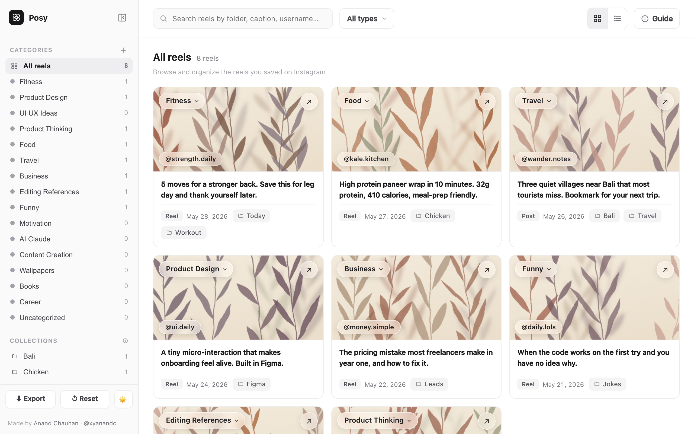
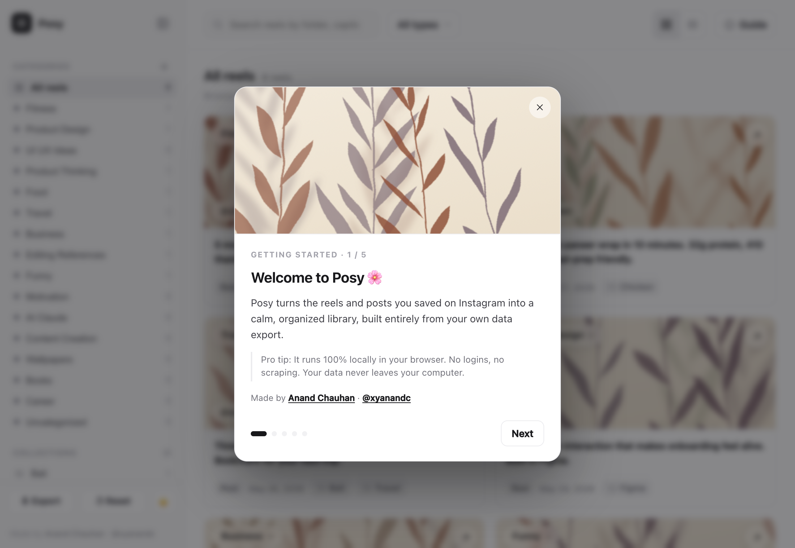
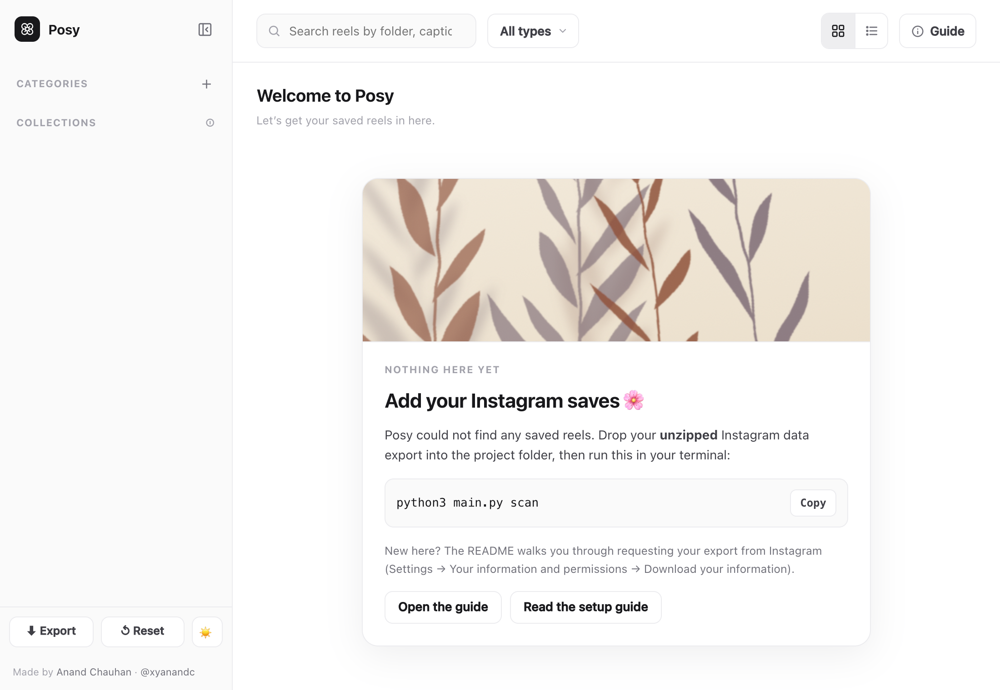

# 🌸 Posy

**Posy turns the reels and posts you saved on Instagram into a calm, searchable,
self organized library, built entirely from your own data export.**

* 🔒 **100% local and private.** No login, no scraping, no servers. Posy only reads
  the export file you already downloaded from Instagram. Your data never leaves
  your computer.
* 🗂️ **Auto categorizes** your saves using your own Instagram collections, then
  lets you re file anything in one click.
* 🖼️ A beautiful **offline dashboard**: light and dark, responsive on phone,
  tablet and desktop, with unique watercolor cover art for every reel.
* 🐍 **Pure Python standard library.** Nothing to `pip install` to get started.

> Posy began life as **LTSOP**, short for "Lost The Saved Ones Project", because
> we all save hundreds of reels and never find them again. 😄



## Contents

1. [Get your Instagram data export](#1-get-your-instagram-data-export)
2. [Install Posy](#2-install-posy)
3. [Run it](#3-run-it)
4. [Open your library](#4-open-your-library)
5. [Organize your reels](#5-organize-your-reels)
6. [Commands](#commands)
7. [How categorization works](#how-categorization-works)
8. [Privacy and safety](#privacy-and-safety)
9. [Project layout](#project-layout)
10. [FAQ](#faq)
11. [Author](#author)

## 1. Get your Instagram data export

Posy reads the official data export Instagram gives you. It never touches your
account.

1. On Instagram, go to **Settings → Accounts Center → Your information and
   permissions → Download your information**.
2. Request a download of **Your information**. Either format works:
   * **HTML** (easiest to read) is fully supported.
   * **JSON** is also supported.
3. Make sure **Saved** activity is included (the default "All" includes it).
4. Instagram emails you a `.zip` when it is ready. This can take minutes to a day.
5. **Unzip it.** You get a folder like `instagram-yourname-2026-06-15-XXXX/`
   containing `your_instagram_activity/saved/...`.

> You only need the **Saved** part, but the whole export is fine. Posy ignores
> everything else.

## 2. Install Posy

**Requirements:** Python 3.8 or newer (standard library only, nothing else to
install). Node is optional and only used for the in dashboard feedback toolbar.

```bash
git clone https://github.com/theacmajor/posy.git
cd posy
```

Now drop your **unzipped** Instagram export folder into the project directory:

```
posy/
  instagram-yourname-2026-06-15-XXXX/   <-  put your unzipped export here
  main.py
  ig_organizer/
  ...
```

## 3. Run it

```bash
python3 main.py scan
```

This parses your export and creates:

* `output/saved_items.json` and `output/saved_items.csv`, your normalized database
* an `Instagram Saved Library/` folder with category subfolders and a dashboard

Optional and recommended, give every card a unique watercolor cover:

```bash
python3 main.py covers
```

## 4. Open your library

Open the dashboard file in your browser:

```
Instagram Saved Library/_metadata/index.html
```

Or serve it locally, which is nicer because it enables a few browser features:

```bash
python3 -m http.server 8000 --directory "Instagram Saved Library/_metadata"
# then visit http://localhost:8000/index.html
```

**A welcome guide pops up on first open** and walks you through everything. You
can replay it anytime from the **ⓘ Guide** button at the top right.



If you open the dashboard before adding an export, it tells you exactly what to
do next:



### What you can do in the dashboard

* Browse by **Category** (a tidy scheme) or **Collection** (your original Instagram folders)
* **Click a card's category pill** to re file it. Saved instantly to your browser.
* **Search** by caption, username or folder, toggle **grid and list**, expand captions
* **Create your own categories**, switch **light and dark**, and **Export** your edits
* Works on **phone, tablet and desktop**

## 5. Organize your reels

Posy does **not** download videos, because that would mean scraping Instagram.
The dashboard is your organized index. If you separately download a reel and want
it filed too, drop the file into `Instagram Saved Library/01 Inbox/` and run:

```bash
python3 main.py organize        # copies (originals untouched) into category folders
python3 main.py organize --move # move instead of copy
```

Name files with the reel's shortcode, for example `reel_DZgszzuocNc.mp4`, for
reliable matching, or use `Instagram Saved Library/_metadata/manual_mapping.csv`.

## Commands

* `python3 main.py scan` parses the export into the database, folders and
  dashboard. Safe to re run, and it keeps your edits.
* `python3 main.py covers` generates a unique watercolor cover per reel. Local,
  offline, instant.
* `python3 main.py organize` files media from `01 Inbox/` into category folders
  (copy by default, add `--move` to move).
* `python3 main.py build-index` rebuilds just the dashboard from the current
  database.
* `python3 main.py scan --export PATH` points at a specific export folder instead
  of auto detecting.

The same actions are available as `npm run scan`, `npm run covers`,
`npm run organize` and `npm run build-index`.

## How categorization works

1. **Your Instagram collections win.** If a reel is in a folder you made (Workout,
   Bali, Chicken and so on), Posy files it by that. Your own labels are the
   strongest signal.
2. **Keyword fallback.** Reels that only live in the default "Today" bucket are
   scored against caption and hashtag keywords. Ambiguous ones stay
   **Uncategorized** rather than being guessed wrong.
3. **You are in control.** `suggested_category` is a starting point.
   `final_category` is yours. Edit it in the dashboard, where it auto saves, or in
   the CSV and JSON.

Categories, keywords and collection routing live in
[`ig_organizer/config.py`](ig_organizer/config.py), which is easy to tune.

## Privacy and safety

* **Nothing leaves your machine.** There are no network calls to Instagram, ever.
  Posy cannot and does not log in, scrape, or bypass anything.
* **Your originals are never deleted.** `organize` copies by default.
* **Your data is git ignored.** Your export, the generated library and outputs are
  excluded from version control. Only code is tracked. Never commit your export.
* Every run is logged to `Instagram Saved Library/_metadata/logs/`.

## Project layout

```
main.py                 CLI entry (scan, covers, organize, build-index)
ig_organizer/
  config.py             categories, keywords, collection routing
  parser.py             export discovery, HTML and JSON parsing
  categorize.py         scoring engine
  organize.py           Inbox media matching, safe copy and move
  covers.py             watercolor cover generator (pure SVG)
  indexer.py            the self contained dashboard
  store.py              JSON and CSV read and write, paths, logging
tools/                  optional esbuild bundle for the feedback toolbar
```

## FAQ

**Does Posy download my reels?** No. It organizes an index of your saves. The
videos stay on Instagram. The actual files would require scraping, which Posy
intentionally never does.

**My export is JSON, not HTML, does it work?** Yes, both are supported.

**Lots of reels are "Uncategorized", is that a bug?** No, it is honest. Those are
saves that only sit in Instagram's default "Today" bucket with no caption signal.
Sort them in the dashboard, or filter a Collection and bulk assign in list view.

**Will it work offline?** Completely. After `scan` and `covers`, the dashboard
needs no internet.

**Can I change the categories?** Yes. Make your own in the dashboard with the ＋
button, or edit [`ig_organizer/config.py`](ig_organizer/config.py).

## Author

Made by **Anand Chauhan**.

* Website: [anandis.pro](https://www.anandis.pro)
* X: [@xyanandc](https://x.com/xyanandc)

## License

[MIT](LICENSE). Built with 🌸 for everyone who saves more than they revisit.
